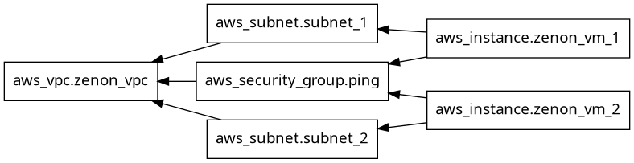
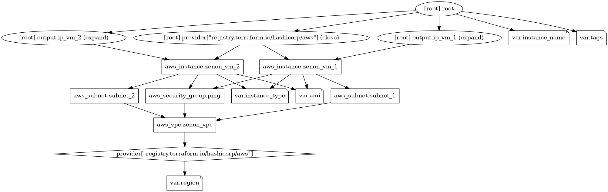

# AWS Terraform Project


This project creates a simple AWS architecture with a VPC, public subnets, a security group, and EC2 instances using Terraform.

## Project overview

The infrastructure includes:
- VPC
- Internet Gateway
- Public route table
- Two public subnets
- EC2 instances in each subnet
- Security group allowing ICMP traffic
- Outputs for the public IP and SG IDs

## Repository structure

```text
aws/
├── README.md
├── images/
│   ├── arch.png
│   └── graph.png
└── terraform/
    ├── main.tf
    ├── variables.tf
    ├── outputs.tf
    └── terraform.tfstate
```

## Architecture



```text
Internet
   │
   ▼
Internet Gateway
   │
   ▼
VPC 10.0.0.0/16
   ├── Subnet 1: 10.0.1.0/24
   │      └── EC2 instance 1
   └── Subnet 2: 10.0.2.0/24
          └── EC2 instance 2
```

## Terraform resources used

This project uses the following Terraform resources:
- `aws_vpc`
- `aws_internet_gateway`
- `aws_route_table`
- `aws_subnet`
- `aws_route_table_association`
- `aws_security_group`
- `aws_instance`
- `output`

## Terraform graph


## Prerequisites

Before running Terraform, make sure you have:
- Terraform installed
- AWS CLI installed and configured
- An AWS account with permissions to create EC2 resources

Configure AWS credentials:

```bash
aws configure
```

## Terraform commands

Initialize the project:

```bash
cd terraform
terraform init
```

Validate syntax:

```bash
terraform validate
```

Preview changes:

```bash
terraform plan
```

Deploy infrastructure:

```bash
terraform apply --auto-approve
```

Destroy infrastructure:

```bash
terraform destroy --auto-approve
```

## Useful AWS CLI commands

List available AMIs for Ubuntu in eu-north-1:

```bash
aws ec2 describe-images \
  --owners 099720109477 \
  --region eu-north-1 \
  --filters \
    "Name=name,Values=ubuntu/images/hvm-ssd-gp3/ubuntu-noble-24.04-amd64-server-*" \
    "Name=state,Values=available" \
  --query 'Images[*].[ImageId,Name,CreationDate]' \
  --output table
```

List free-tier eligible instance types:

```bash
aws ec2 describe-instance-types \
  --filters "Name=free-tier-eligible,Values=true" \
  --query "InstanceTypes[*].InstanceType" \
  --output table
```

List EC2 instances:

```bash
aws ec2 describe-instances --output table
```

List security groups:

```bash
aws ec2 describe-security-groups --output table
```

Show instance public IP:

```bash
aws ec2 describe-instances \
  --query 'Reservations[*].Instances[*].[InstanceId,PublicIpAddress,State.Name]' \
  --output table
```

## Generate architecture diagrams

From the `terraform` folder, generate the graph PNG files:

```bash
terraform graph -type=plan | dot -Tpng > ../images/graph.png
terraform graph | dot -Tpng > ../images/arch.png
```

Then open them locally:

```bash
eog ../images/arch.png
eog ../images/graph.png
```

## Notes

- `0.0.0.0/0` means all IPv4 addresses are allowed.
- For production, prefer restricting ingress by a specific CIDR or your office/public IP.
- If ping is not working, check the EC2 security group and the instance firewall configuration.

## Useful links

- Terraform AWS provider docs
- AWS EC2 docs
- AWS security group documentation
